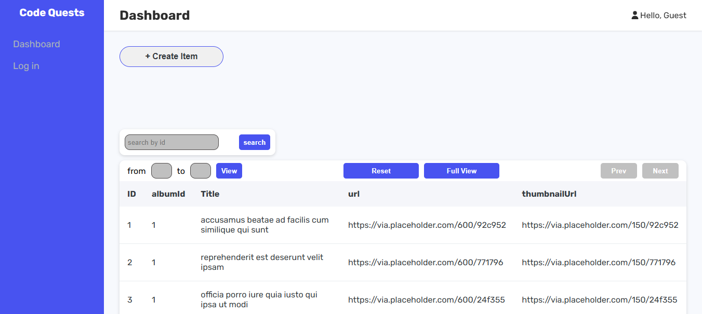
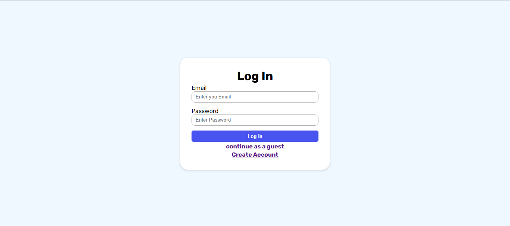
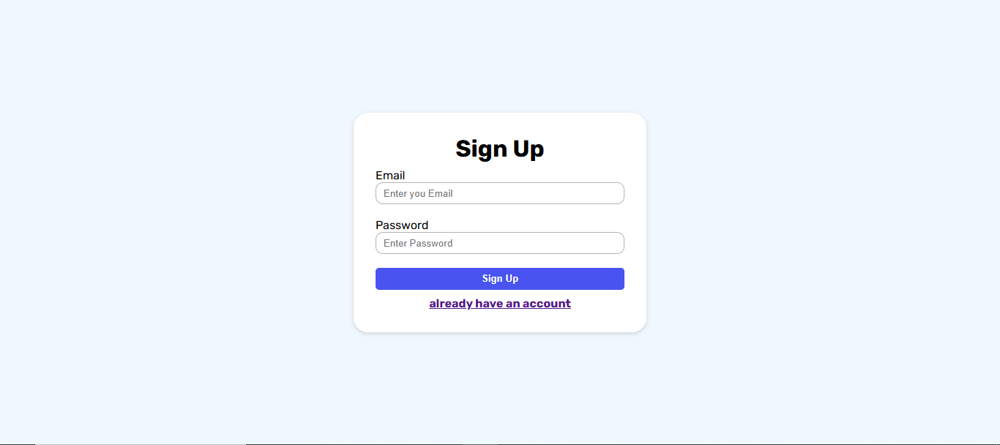
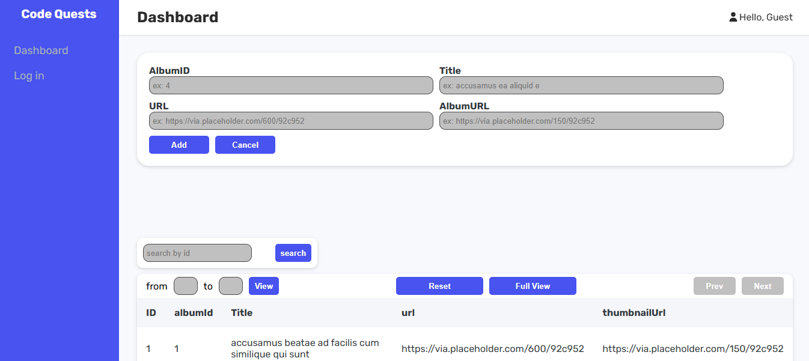

## Setup instructions:
1. Clone the repository
2. Go to project folder:
3. Install dependencies (Node.js, React , react router , vite):
4. Run the project:(npm run dev)

  
  
  
  

## Tools:
- React.js
- Vite
- React router
- Css
- Local Storage

## Features

- User authentication (login/register) with local storage
- Fetch and display data from JSONPlaceholder
- Display data in a paginated
- Context Api for state management
- slice viewed data using two inputs [From , to]
- Full view button to show all records in one page
- Reset button that return to the initial state of the table
- Search bar to search for record by ID
- Form to add new record
- Responsive design for mobile and desktop
- Real-time updates

## API used
all data comes from  "https://jsonplaceholder.typicode.com/photos"

